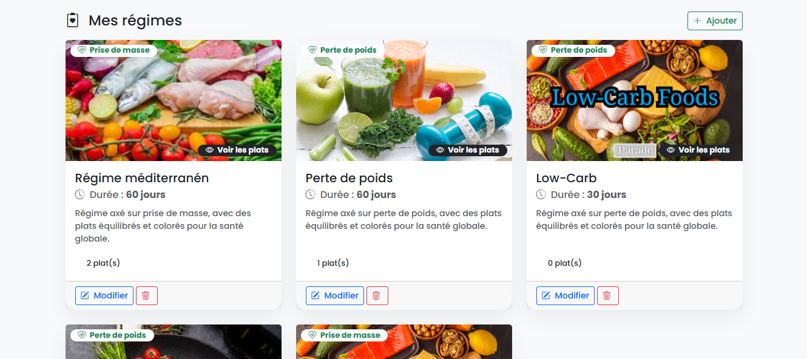
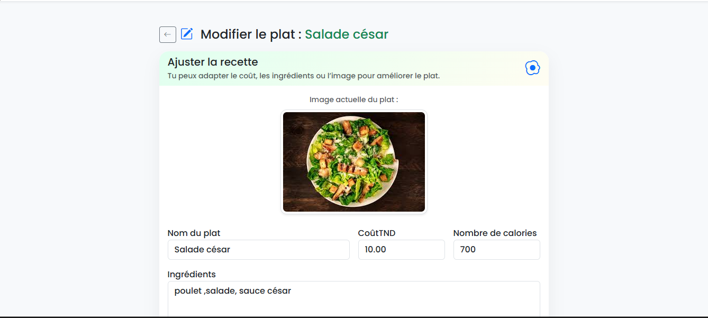
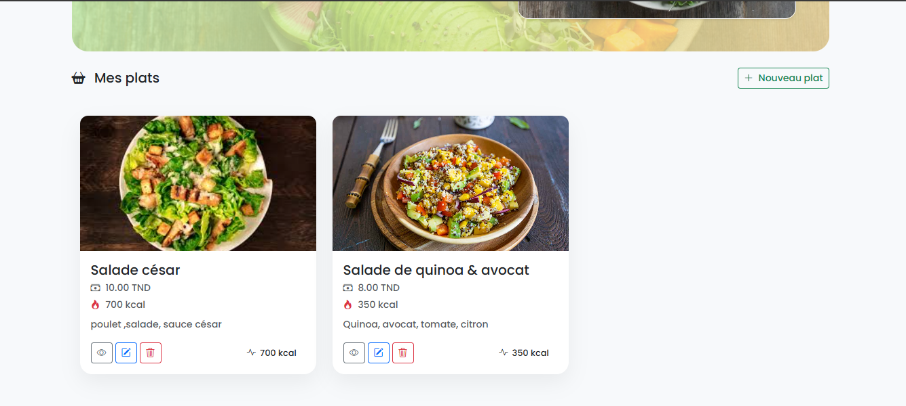

# 🥗 Nutri-Regime — Application Symfony

Nutri-Regime est une application web développée avec Symfony pour gérer :

- des régimes nutritionnels
- des plats associés
- un espace administrateur sécurisé

Le design utilise un thème nutrition & bien-être.

---

## 📸 Captures d’écran

### 🔐 Page Login

### 🥗 Liste des Régimes

### 🍽️ Liste des Plats

### 📋 Détail d’un Régime + Plats

---

## 🚀 Fonctionnalités

- Authentification Admin (login / logout)
- CRUD Régimes
- CRUD Plats
- Upload d’images
- Carte cliquable → liste des plats
- Design moderne (Bootstrap 5 + thème nutrition)
- Relations Doctrine (OneToMany)

---
